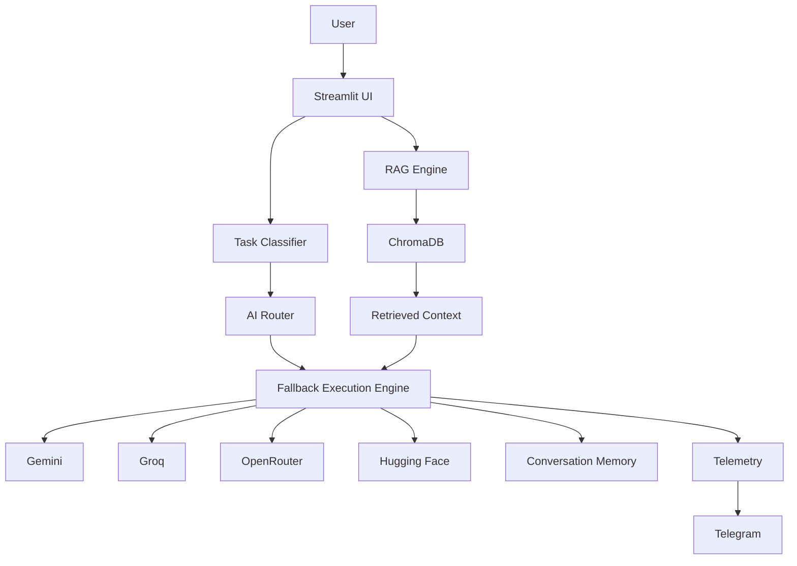

# 🌊 NeuraFlow AI

### Enterprise RAG & Multi-LLM Document Intelligence Platform

NeuraFlow AI is a document-intelligence application that combines **RAG, multi-provider LLM routing, conversational memory, streaming responses, explainability, and fallback handling** in one system.

> **Purpose:** I built NeuraFlow AI to explore how a production-style AI application can intelligently select between multiple LLM providers, retrieve relevant document context, and remain resilient when a provider is unavailable or rate-limited.

[](https://python.org)
[](https://streamlit.io)
[](https://www.trychroma.com/)
[](https://ai.google.dev/)
[](https://groq.com/)
[](https://openrouter.ai/)
[](LICENSE)

---

## 🎯 Why I Created NeuraFlow AI

Traditional document-chat applications often depend on a single LLM provider. That creates three problems:

- **Provider dependency** when an API becomes unavailable.
- **Cost and latency inefficiency** when every query uses the same model.
- **Poor transparency** when users cannot see why a model was selected.

NeuraFlow AI addresses these problems with a modular architecture separating **retrieval, task classification, model selection, fallback execution, memory, and telemetry**.

---

## ✨ Core Features

| Feature | What it does |
|---|---|
| 🧠 RAG | Retrieves relevant content from uploaded PDF documents using ChromaDB |
| 🔀 Multi-LLM Routing | Selects an appropriate provider based on the query/task |
| 🛡️ Fallback Engine | Tries alternative providers when the selected provider fails or is rate-limited |
| 📄 PDF Intelligence | Extracts and indexes PDF content for contextual answers |
| 💬 Conversation Memory | Maintains context across interactions |
| ⚡ Streaming | Displays generated responses progressively |
| 🔍 Decision Transparency | Shows routing decisions, latency and token information when available |
| 🌐 Tool Calling | Supports configured document retrieval, web-search and calculation tools |
| 📡 Telegram Telemetry | Sends operational events and analytics notifications when configured |
| 🎨 Streamlit UI | Provides a responsive dark-mode interface for document chat |

---

## 🏗️ Architecture



### Request flow

1. User uploads a PDF or asks a question.
2. PDF text is extracted and indexed in ChromaDB.
3. The query is classified by task/domain.
4. The router selects a configured LLM provider.
5. RAG retrieves relevant document context when applicable.
6. The fallback engine retries with another provider when necessary.
7. The response is streamed back to the user.
8. Routing, latency and usage information is surfaced when available.

---

## 🤖 Supported Providers

| Provider | Role |
|---|---|
| Google Gemini | General reasoning / generation |
| Groq | Fast inference |
| OpenRouter | Multi-model gateway |
| Hugging Face | Additional model/provider option |

> Model IDs and availability can change. Configure the providers supported by the current application version rather than relying on historical model names.

---

## 🛡️ Reliability Design

NeuraFlow separates provider selection from provider execution so failures can be handled centrally.

```text
Primary Provider
      ↓
API error / rate limit / timeout
      ↓
Fallback Manager
      ↓
Next configured provider
      ↓
Response
```

Fallback handling improves resilience without coupling the application to one LLM vendor.

> **Important:** Fallback logic does not guarantee 100% uptime. Actual reliability depends on provider availability, quotas, networking, infrastructure and configuration.

---

## 🧪 Engineering & Quality

The repository includes tooling for:

- `pytest` — automated tests
- `flake8` — linting
- `black` — formatting
- `isort` — import ordering
- `bandit` — security scanning
- Docker containerization
- Kubernetes manifests
- GitHub Actions workflows

Run tests:

```bash
pytest -q
```

Run formatting/lint checks according to the repository configuration:

```bash
black .
isort .
flake8 .
```

---

## 🚀 Getting Started

### 1. Clone

```bash
git clone https://github.com/Piyu242005/NeuraFlow-AI.git
cd NeuraFlow-AI
```

### 2. Create a virtual environment

```bash
python -m venv .venv
```

Activate it:

```bash
# Windows
.venv\Scripts\activate

# macOS/Linux
source .venv/bin/activate
```

### 3. Install dependencies

```bash
pip install -r requirements.txt
```

### 4. Configure environment variables

Create `.env` from the repository environment template and configure the providers/features you intend to use.

Typical variables include:

```env
GEMINI_API_KEY=your_key
GROQ_API_KEY=your_key
OPENROUTER_API_KEY=your_key
HUGGINGFACE_API_KEY=your_key
TELEGRAM_BOT_TOKEN=your_token
TELEGRAM_CHAT_ID=your_chat_id
```

**Never commit real API keys, tokens or credentials.**

### 5. Start the application

```bash
streamlit run app.py
```

---

## 📁 Project Structure

```text
NeuraFlow-AI/
├── .github/workflows/       # CI/CD, tests and validation
├── assets/                  # UI assets and branding
├── k8s/                     # Kubernetes manifests
├── monitoring/              # Monitoring configuration
├── providers/               # LLM provider implementations/interfaces
├── services/                # Core AI/RAG/routing services
│   ├── agent_engine.py
│   ├── ai_router.py
│   ├── fallback_manager.py
│   ├── memory_manager.py
│   ├── rag_engine.py
│   ├── task_classifier.py
│   └── telegram_logger.py
├── utils/                   # UI/helper utilities
├── app.py                   # Streamlit entry point
├── styles.py                # UI styling
├── requirements.txt         # Runtime dependencies
├── .env.example             # Environment template
└── README.md
```

---

## 🐳 Docker

```bash
docker build -t neuraflow-ai .
docker run --env-file .env -p 8501:8501 neuraflow-ai
```

Use the repository Docker configuration as the source of truth for the exposed port and runtime command.

---

## ☸️ Kubernetes

The repository contains Kubernetes manifests for containerized deployment, including application deployment, service routing and autoscaling configuration.

Before production deployment, review:

- Secrets and environment variables
- Resource requests/limits
- Ingress/domain configuration
- Health probes
- Persistent storage requirements
- Provider quotas
- Monitoring configuration

> Kubernetes manifests demonstrate deployment architecture; actual production availability depends on the target cluster and configuration.

---

## 📊 Observability

When configured, NeuraFlow can expose operational information such as:

- Request activity
- Model/provider selection
- Latency
- Token usage where returned by the provider
- Fallback events
- Document-processing activity

Telegram notifications can be enabled for operational alerts.

---

## 📸 Demo

### Dashboard


### Agent Decision Panel


### Video Walkthrough

[Watch the architecture/query walkthrough](./Project_Videos_and_PDFs/Anatomy_of_a_Query__Deconstructing_a_Multi-LLM_Pipeline.mp4)

---

## 🔐 Security Notes

- Store secrets in environment variables or your deployment secret manager.
- Never expose server-side API keys in the frontend.
- Do not commit `.env` files containing credentials.
- Validate uploaded documents and user inputs before processing.
- Review provider permissions and quotas before production deployment.

---

## 🗺️ Roadmap

- [x] PDF RAG with ChromaDB
- [x] Multi-provider LLM architecture
- [x] Intelligent task routing
- [x] Provider fallback handling
- [x] Streaming responses
- [x] Conversation memory
- [x] Telegram telemetry
- [x] Docker/Kubernetes deployment configuration
- [ ] Voice interface with Whisper
- [ ] Persistent production database
- [ ] Advanced admin/analytics dashboard
- [ ] Evaluation suite for retrieval and answer quality
- [ ] Cost-aware model routing

---

## 📌 Project Status

**Status: Active development**

NeuraFlow AI is a portfolio-grade AI engineering project focused on **RAG, LLM orchestration, reliability engineering and production-oriented architecture**. Some infrastructure components require environment-specific configuration before deployment.

---

## 👨‍💻 Author

**Piyush Ramteke**  
Data Scientist · AI Engineer · Python Developer

- GitHub: https://github.com/Piyu242005
- LinkedIn: https://www.linkedin.com/in/piyu24

---

## 📄 License

MIT License — see [LICENSE](LICENSE).

---

⭐ If NeuraFlow AI is useful to you, consider starring the repository.
