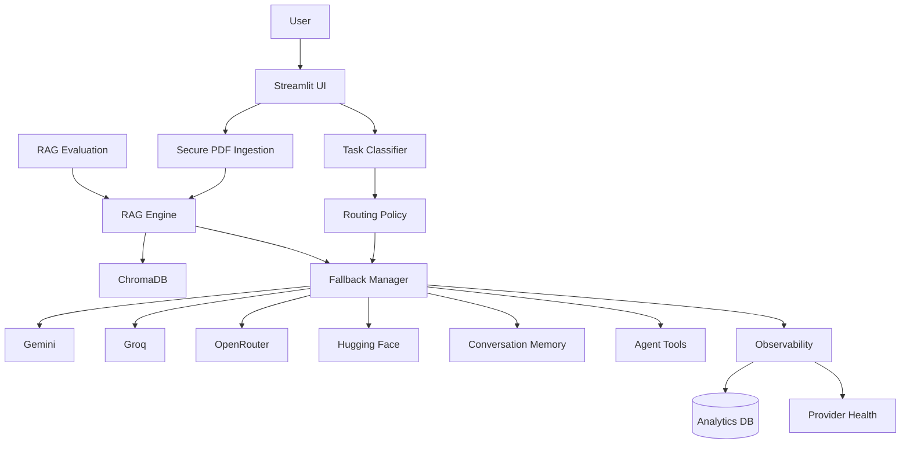

# 🌊 NeuraFlow AI

### Production-Oriented RAG & Multi-LLM Document Intelligence Platform

NeuraFlow AI combines **RAG, policy-based multi-LLM routing, automatic fallback, conversational memory, streaming, agent tools, telemetry, and offline evaluation** into one modular AI application.

> **Purpose:** Explore how a production-style AI system can choose providers using quality, speed, cost and reliability signals while remaining resilient when an LLM provider fails.

[](https://python.org)
[](https://streamlit.io)
[](https://www.trychroma.com/)
[](LICENSE)

---

## ✨ What NeuraFlow Does

| Capability | Implementation |
|---|---|
| 🧠 RAG | Persistent ChromaDB + chunk metadata + reranking |
| 🔀 Smart Routing | Task classification + quality/speed/cost/reliability scoring |
| 🛡️ Fallback | Automatic provider failover for errors and rate limits |
| 📄 PDF Intelligence | PDF extraction, indexing and semantic retrieval |
| 💬 Memory | Multi-turn conversational context |
| ⚡ Streaming | Progressive provider responses |
| 🤖 Agent Tools | Document search, web search and calculator tools |
| 📊 Observability | Latency, provider usage, fallback and streaming metrics |
| 💰 Cost Tracking | Configurable token-based cost estimation |
| 🩺 Provider Health | Success rate, latency and recent error tracking |
| 🧪 Evaluation | Offline RAG recall/precision regression utilities |
| 🔐 Security | PDF validation, filename sanitization and injection signals |

---

## 🏗️ Architecture



### Routing flow

```text
Query
  ↓
Task classification
  ↓
Quality + Speed + Cost + Reliability scoring
  ↓
Best configured provider
  ↓
Provider failure?
  ├── No → Response
  └── Yes → Fallback chain → Response
```

---

## 🤖 Providers

- Google Gemini — general generation/reasoning
- Groq — fast inference
- OpenRouter — multi-model gateway
- Hugging Face — open-model option

Provider model IDs and pricing change over time. The routing policy therefore keeps cost rates configurable rather than hard-coding vendor pricing as authoritative.

Example environment variables:

```env
GEMINI_INPUT_USD_PER_1K=0
GEMINI_OUTPUT_USD_PER_1K=0
GROQ_INPUT_USD_PER_1K=0
GROQ_OUTPUT_USD_PER_1K=0
OPENROUTER_INPUT_USD_PER_1K=0
OPENROUTER_OUTPUT_USD_PER_1K=0
```

Replace these with current rates when you want meaningful cost estimates.

---

## 🧠 RAG Improvements

NeuraFlow now supports:

- validated chunk parameters
- context-preserving chunk overlap
- chunk-level metadata
- semantic distance + lexical-overlap reranking
- source-aware retrieval via `retrieve_with_sources()`
- deterministic offline evaluation

For production workloads, the next vector-search upgrade is a managed vector database plus hybrid retrieval and a dedicated cross-encoder reranker.

---

## 🧪 Evaluation

The repository contains `evaluation/rag_evaluator.py` and a starter labelled dataset.

Run:

```bash
pytest -q
```

The evaluator measures retrieval recall, answer-term precision and a combined regression score. For serious production evaluation, extend the dataset with human labels for relevance, faithfulness, correctness and hallucination rate.

---

## 🔐 Security

Security helpers are available in `services/security.py` for PDF validation, filename sanitization and common prompt-injection detection.

These checks are signals and guardrails, not a complete security boundary. Tool authorization, authentication, rate limiting and secret management must remain enforced at the application/deployment layer.

---

## 📊 Observability

The system records analytics such as provider usage, latency, RAG timing, fallback rate and streaming performance. Provider-health and cost-tracking modules provide a foundation for an operations dashboard.

---

## 🚀 Getting Started

```bash
git clone https://github.com/Piyu242005/NeuraFlow-AI.git
cd NeuraFlow-AI
python -m venv .venv
pip install -r requirements.txt
```

Create `.env` from `.env.example` and configure the providers you want to use.

For portable Linux/Streamlit Cloud deployment, run:

```bash
streamlit run streamlit_app.py
```

The launcher normalizes the legacy Windows-local page-icon path in `app.py`.

Never commit real API keys or credentials.

---

## 📁 Project Structure

```text
NeuraFlow-AI/
├── .github/workflows/       # CI quality checks
├── assets/                  # UI assets
├── evaluation/              # Offline RAG evaluation
├── k8s/                     # Kubernetes manifests
├── monitoring/              # Monitoring configuration
├── providers/               # LLM provider adapters
├── services/                # AI, RAG, routing and telemetry
│   ├── agent_engine.py
│   ├── agent_executor.py
│   ├── ai_router.py
│   ├── cost_tracker.py
│   ├── db_manager.py
│   ├── fallback_manager.py
│   ├── memory_manager.py
│   ├── policy_agent_engine.py
│   ├── provider_health.py
│   ├── rag_engine.py
│   ├── router_policy.py
│   ├── security.py
│   └── task_classifier.py
├── tests/                   # Automated tests
├── app.py                   # Existing Streamlit application
├── streamlit_app.py         # Portable deployment entrypoint
├── requirements.txt
└── README.md
```

---

## 🐳 Docker / ☸️ Kubernetes

The repository includes Docker and Kubernetes deployment configuration. Before production deployment, configure a managed secret store, persistent vector storage, resource limits, health probes, TLS, authentication and rate limiting. Move multi-instance analytics from SQLite to PostgreSQL.

See [`docs/production-readiness.md`](docs/production-readiness.md).

---

## 🔄 Quality Gates

GitHub Actions runs:

```text
compileall → pytest → black → isort → flake8 → bandit
```

---

## 🗺️ Roadmap

- [x] PDF RAG with ChromaDB
- [x] Multi-provider LLM architecture
- [x] Policy-based routing
- [x] Provider fallback handling
- [x] Streaming responses
- [x] Conversation memory
- [x] RAG reranking
- [x] Offline RAG evaluation foundation
- [x] Provider health foundation
- [x] Cost tracking foundation
- [x] Security validation helpers
- [ ] Hybrid vector + keyword retrieval
- [ ] Cross-encoder reranking
- [ ] Production PostgreSQL persistence
- [ ] Authentication / multi-user workspaces
- [ ] Full RAG faithfulness/correctness benchmark
- [ ] Voice interface with Whisper

---

## 📌 Project Status

**Active development — portfolio-grade AI engineering project.**

NeuraFlow demonstrates practical knowledge of **RAG, LLM orchestration, reliability engineering, observability, evaluation and production-oriented AI architecture**.

## 👨‍💻 Author

**Piyush Ramteke** — Data Scientist · AI Engineer · Python Developer

- GitHub: https://github.com/Piyu242005
- LinkedIn: https://www.linkedin.com/in/piyu24

## 📄 License

MIT License — see [LICENSE](LICENSE).
