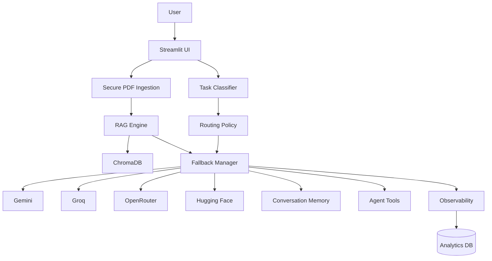

# 🌊 NeuraFlow AI

### Production-Oriented RAG & Multi-LLM Document Intelligence Platform

NeuraFlow AI combines **RAG, policy-based multi-LLM routing, automatic fallback, conversational memory, streaming, agent tools, telemetry, and offline evaluation** into one modular Streamlit application.

> **Purpose:** Explore how a production-style AI system can choose providers using quality, speed, cost and reliability signals while remaining resilient when an LLM provider fails.

[](https://python.org)
[](https://streamlit.io)
[](https://www.trychroma.com/)
[](LICENSE)

---

## ✨ Core Capabilities

| Capability | Implementation |
|---|---|
| 🧠 RAG | Persistent ChromaDB + chunk metadata + reranking |
| 🔀 Smart Routing | Task classification + quality/speed/cost/reliability scoring |
| 🛡️ Fallback | Automatic provider failover |
| 📄 PDF Intelligence | PDF extraction, indexing and semantic retrieval |
| 💬 Memory | Multi-turn conversational context |
| ⚡ Streaming | Progressive provider responses |
| 🤖 Agent Tools | Document search, web search and calculator |
| 📊 Observability | Latency, provider usage and fallback metrics |
| 🧪 Evaluation | Offline RAG regression utilities |
| 🔐 Security | PDF validation, filename sanitization and injection signals |

## 🏗️ Architecture



## 🚀 Run Locally

```bash
git clone https://github.com/Piyu242005/NeuraFlow-AI.git
cd NeuraFlow-AI
python -m venv .venv
pip install -r requirements.txt
streamlit run app.py
```

Create `.env` from `.env.example` and configure the providers you want to use.

Never commit real API keys or credentials.

## 📁 Project Structure

```text
NeuraFlow-AI/
├── .github/workflows/       # CI quality checks
├── assets/                  # UI assets
├── evaluation/              # Offline RAG evaluation
├── monitoring/              # Monitoring configuration
├── providers/               # LLM provider adapters
├── services/                # AI, RAG, routing and telemetry
├── tests/                   # Automated tests
├── app.py                   # Streamlit application entrypoint
├── requirements.txt         # Python dependencies
└── README.md
```

The repository intentionally keeps the runtime structure focused on the current Streamlit application. Deprecated launchers and unused container/orchestration configuration have been removed.

## 🧪 Evaluation

The repository contains `evaluation/rag_evaluator.py` and a starter labelled dataset.

```bash
pytest -q
```

## 🔐 Security

Security helpers are available in `services/security.py` for PDF validation, filename sanitization and common prompt-injection detection.

These checks are guardrails rather than a complete security boundary. Keep authentication, rate limiting and secret management at the application/deployment layer.

## 🔄 Quality Gates

GitHub Actions runs the repository quality checks including compilation, tests, formatting, linting and security scanning.

## 🗺️ Roadmap

- [x] PDF RAG with ChromaDB
- [x] Multi-provider LLM architecture
- [x] Policy-based routing
- [x] Provider fallback handling
- [x] Streaming responses
- [x] Conversation memory
- [x] RAG reranking
- [x] Offline RAG evaluation foundation
- [x] Provider health foundation
- [x] Security validation helpers
- [ ] Hybrid vector + keyword retrieval
- [ ] Cross-encoder reranking
- [ ] Production PostgreSQL persistence
- [ ] Authentication / multi-user workspaces
- [ ] Full RAG faithfulness/correctness benchmark
- [ ] Voice interface with Whisper

## 📌 Project Status

**Active development — portfolio-grade AI engineering project.**

NeuraFlow demonstrates practical knowledge of **RAG, LLM orchestration, reliability engineering, observability, evaluation and production-oriented AI architecture**.

## 👨‍💻 Author

**Piyush Ramteke** — Data Scientist · AI Engineer · Python Developer

- GitHub: https://github.com/Piyu242005
- LinkedIn: https://www.linkedin.com/in/piyu24

## 📄 License

MIT License — see [LICENSE](LICENSE).
