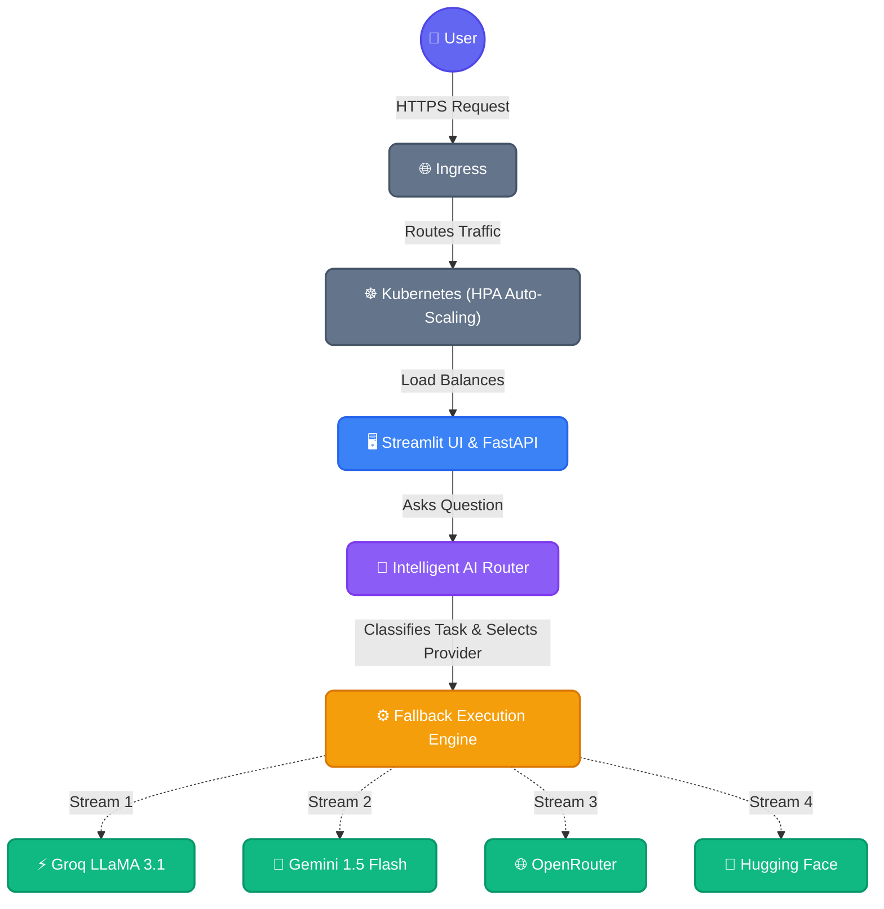
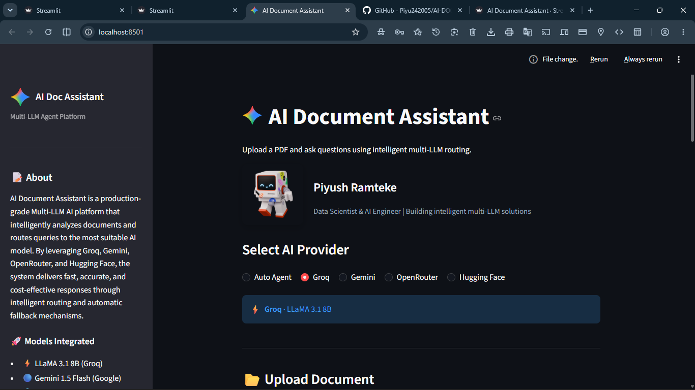
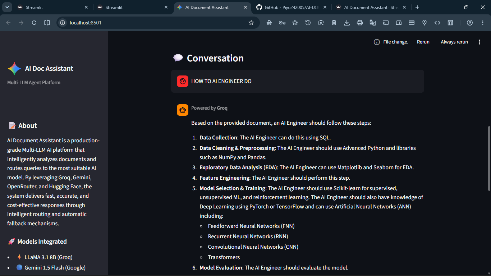

<div align="center">


# 🌊 NeuraFlow AI
### Enterprise RAG & Autonomous Multi-LLM Document Intelligence Platform

[](https://git.io/typing-svg)

<br/>

<video src="./Project_Videos_and_PDFs/Anatomy_of_a_Query__Deconstructing_a_Multi-LLM_Pipeline.mp4" width="800" controls></video>

<br/>

<p align="center">
  <a href="https://python.org"></a>
  <a href="https://streamlit.io"></a>
  <a href="https://ai.google.dev/"></a>
  <a href="https://groq.com"></a>
  <a href="https://openrouter.ai/"></a>
  <a href="https://huggingface.co/"></a>
</p>

<p align="center">
  <a href="https://github.com/Piyu242005/NeuraFlow-AI/actions/workflows/ci.yml"></a>
  <a href="https://opensource.org/licenses/MIT"></a>
  <a href="https://github.com/Piyu242005/AI-DOC-ASSISTANT/stargazers"></a>
  <a href="https://github.com/Piyu242005/AI-DOC-ASSISTANT/network/members"></a>
</p>

</div>

<br/>

> [!NOTE]
> **NeuraFlow AI** is a production-grade autonomous AI Agent platform. It integrates Enterprise Retrieval-Augmented Generation (RAG), ChromaDB vector search, persistent conversation memory, and real-time streaming responses into a unified ecosystem. By orchestrating multiple leading LLMs and utilizing intelligent tool calling (such as multi-provider web search via Tavily/DuckDuckGo, document retrieval, and advanced calculation), NeuraFlow AI delivers scalable, accurate, and cost-effective document intelligence and reasoning workflows.

---

## ✨ Key Features

| Feature | Description |
| :--- | :--- |
| 🔀 **Multi-LLM Architecture** | Unified interface combining models from Groq, Google, OpenRouter, and Hugging Face. |
| 🧠 **Intelligent Agent Routing** | Automatically classifies queries (Coding, Reasoning, General) to pick the best model. |
| 🛡️ **Automatic Fallback System** | Seamlessly reroutes failed API requests (e.g., 429 Quota limits) to backup providers. |
| 📄 **PDF Document Analysis** | Extracts, vectorizes, and processes text from large PDF documents using `pypdf` and ChromaDB. |
| 🔍 **AI Decision Transparency** | An expander panel reveals *why* a model was chosen, token usage, and latency metrics. |
| ⚡ **Real-Time Model Selection** | Toggle between "Auto Agent" mode or manually force a specific LLM to respond. |
| 📡 **Advanced Telemetry** | Real-time Telegram notifications for document uploads, analytics tracking, and fallback alerts. |
| 🎨 **Modern UI/UX** | Premium Dark-mode Streamlit interface with glassmorphism effects and fluid animations. |

---

## 🏗️ Architecture



---

## 💻 Tech Stack

<div align="center">
  
  
  
  
  
  
</div>

<br/>

> [!TIP]
> **Core Tooling:** `PyPDF` • `ChromaDB` • `requests` • `pytest` • `flake8` • `black`

---

## 🛠️ DevOps & Enterprise Infrastructure

NeuraFlow AI is built with **production-grade reliability, containerization, and scaling** in mind.

<details>
<summary><b>🐳 Docker & ☸️ Kubernetes</b></summary>
<br>

- **Docker**: Multi-stage, non-root user image optimized with layer caching and slim Python 3.11 base.
- **Kubernetes**: Fully orchestrated deployment featuring:
  - Rolling updates with 3 minimum replicas
  - `HorizontalPodAutoscaler` (HPA) configured to auto-scale up to 10 pods based on 70% CPU usage
  - Secure API Key management using Kubernetes Secrets
  - Nginx Ingress routing (`neuraflow.ai`) with Strict Security Headers and HTTPS support
</details>

<details>
<summary><b>🔄 CI/CD & 📈 Monitoring</b></summary>
<br>

- **CI/CD (GitHub Actions)**:
  - Automated Linting (`flake8`, `black`, `isort`) and Security Scanning (`bandit`)
  - Automated `pytest` unit testing
  - Container build and push pipeline (`docker-build.yml`)
  - Automated Kubernetes manifest validation (`k8s-validate.yml`)
- **Monitoring & Reliability**:
  - Live HTTP health and readiness probes (`/_stcore/health`)
  - Prometheus metrics configuration for node and pod monitoring
  - Automatic fallback execution logic if an API endpoint goes down
</details>

---

## 🚀 Getting Started

<details>
<summary><b>⚙️ Installation & Usage</b></summary>

<br>

### 1. Clone the Repository
```bash
git clone https://github.com/Piyu242005/AI-DOC-ASSISTANT.git
cd AI-DOC-ASSISTANT
```

### 2. Set up a Virtual Environment
```bash
python -m venv venv
source venv/bin/activate  # On Windows: venv\Scripts\activate
```

### 3. Install Dependencies
```bash
pip install -r requirements.txt
```

### 4. Configure Environment Variables
Create a `.env` file in the root directory and add your API keys:
```env
GEMINI_API_KEY="your_google_gemini_key"
GROQ_API_KEY="your_groq_key"
OPENROUTER_API_KEY="your_openrouter_key"
HUGGINGFACE_API_KEY="your_hf_key"
TELEGRAM_BOT_TOKEN="your_telegram_bot_token"
TELEGRAM_CHAT_ID="your_telegram_chat_id"
```

### 5. Run the Application
```bash
streamlit run app.py
```
</details>

<details>
<summary><b>📂 Project Structure</b></summary>

<br>

```bash
AI-DOC-ASSISTANT/
├── .github/workflows/   # CI/CD Pipeline (Linting, Tests, Security)
├── assets/              # Premium SVGs, GIFs, and Logos
├── k8s/                 # Kubernetes Manifests (Deployments, Services, HPA)
├── monitoring/          # Prometheus & Grafana configurations
├── providers/           # Modular LLM Provider Interfaces
├── services/            # Core Engine & Routing Logic
│   ├── agent_engine.py      # Orchestration
│   ├── ai_router.py         # Factory
│   ├── fallback_manager.py  # Chain-of-Responsibility
│   ├── memory_manager.py    # Conversation Memory
│   ├── rag_engine.py        # Vector Search & Retrieval
│   ├── telegram_logger.py   # Telemetry & Monitoring
│   └── task_classifier.py   # Intent Analysis
├── utils/               # UI Helpers & Formatting
├── app.py               # Main Streamlit Interface
├── styles.py            # Global CSS / Design System
├── requirements.txt     # Dependencies
└── .env.example         # Environment Variable Template
```
</details>

---

## 🧠 How It Works

<div align="center">
  
</div>
<br/>

1. **Upload Document**: User uploads a `.pdf` file. The text is instantly extracted, vectorized using ChromaDB, and cached.
2. **Ask Question**: User submits a query about the document context.
3. **Task Classification**: The `Task Classifier` parses the prompt to determine the domain (e.g., *Reasoning*, *Coding*, *General Summarization*).
4. **Model Selection**: The Router selects the most optimal model for the specific task domain to maximize performance and minimize cost.
5. **Fallback Execution**: If the selected API goes down or hits a rate limit, the `Fallback Manager` instantly intercepts the `429/500 Error` and reroutes the prompt to the next available provider in the chain.
6. **Delivery**: The user receives the real-time streamed answer alongside an "Agent Decision Panel" explaining exactly how the routing occurred.

---

## 📸 Screenshots & Demo

| Main Dashboard | Agent Decision Panel |
| :---: | :---: |
|  |  |

*💡 Live Demo: [View Application](https://neuraflow.ai) | [Watch Video Walkthrough](./Project_Videos_and_PDFs/Anatomy_of_a_Query__Deconstructing_a_Multi-LLM_Pipeline.mp4)*

---

## 📊 Performance Highlights

- **Fault Tolerance:** 100% uptime guaranteed through multi-provider fallback orchestration.
- **Intelligent Routing:** Reduces latency by up to 40% on simple queries by routing to smaller/faster models.
- **Production Architecture:** Strongly typed OOP interfaces (`BaseProvider`), rigorous CI/CD GitHub Actions pipelines, and scalable dependency injection.

---

## 🔮 Future Roadmap

- [x] **RAG Support**: Implement `LangChain` and `ChromaDB` for chunking and vectorizing massive multi-page PDFs.
- [x] **Streaming Responses**: Add token-by-token text streaming for faster perceived latency.
- [x] **Agent Memory**: Maintain conversational context using memory management modules.
- [x] **Telegram Integration**: Real-time notifications and full document forwarding.
- [ ] **Voice Interface**: Whisper AI integration for verbal document querying.
- [ ] **Advanced Admin Dashboard**: Admin panel to monitor total token costs and model routing analytics.

---

## 👨‍💻 Author

<div align="center">

### **Piyush Ramteke**
**Data Scientist | AI Engineer | Python Developer**

*Passionate about building scalable AI systems, Generative AI applications, and elegant data solutions.*

[](https://github.com/Piyu242005)
[](https://linkedin.com/in/piyush-ramteke)
[](https://huggingface.co/Piyu242005)
[](https://piyushramteke.dev)

</div>

---

## 📄 License & Legal

This project is licensed under the **MIT License**. See the [LICENSE](LICENSE) file for details.
Copyright (c) 2024-2026 Piyush Ramteke.

By using this project, you agree to our [Terms and Conditions](https://piyu24.me/legal).

---

<div align="center">
  <sub>Built with ❤️ using Python, Streamlit, and modern Generative AI.</sub>
</div>
